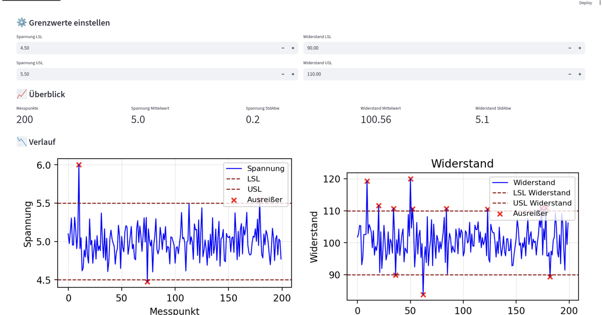

## MARKDOWN
A practical Python project for analyzing production measurement data with outlier detection, Cp/Cpk evaluation and a Streamlit dashboard.

## OVERVIEW

This project demonstrates how production data can be generated, analyzed and visualized using Python.

## Dashboard Preview

## Use Case

The dashboard provides a quick overview of measurement trends, detected outliers and process capability metrics.

## Features
- Data generation
- Statistical analysis
- Outlier detection (Z-score)
- Interactive dashboard
- process capability analysis (Cp / Cpk) in script and dashboard
- CSV upload support for custom datasets
- configurable limits (LSL / USL)
- limit-based outlier detection
- Cp/Cpk calculation and evaluation

## Visualization

- dual plots for voltage and resistance
- highlighted outliers (red markers)
- limit lines (LSL / USL)
- improved layout and readability

## Tech Stack
Python, Pandas, Matplotlib, Streamlit

# Notes

This release represents a functional dashboard for analyzing production measurement data.